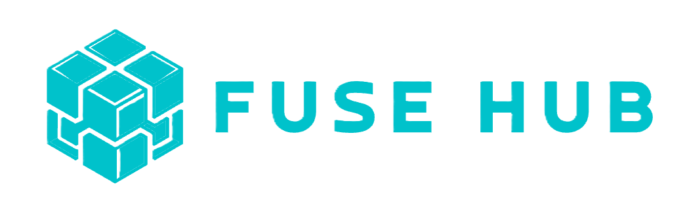

<div align="center">
  
  
  # 📝 Modern Todo Application
  
  <p>
    <strong>A powerful, feature-rich task management application built with React, TypeScript, and Supabase</strong>
  </p>
  
  [](https://www.typescriptlang.org/)
  [](https://reactjs.org/)
  [](https://supabase.com/)
  [](https://tailwindcss.com/)
  
  [Features](#-features) • [Tech Stack](#-tech-stack) • [Getting Started](#-getting-started) • [Usage](#-usage) • [Contributing](#-contributing)
</div>

---

## ✨ Features

### 🎯 **Core Features**
- **Multiple View Modes**: Switch between List, Kanban, Week, and Month views
- **Smart Task Organization**: Group tasks by due dates (Today, Tomorrow, Overdue)
- **Custom Categories**: Create and manage task categories with custom colors
- **Task Status Management**: Track tasks as Upcoming, Completed, or Canceled
- **Real-time Sync**: Instant updates across all devices using Supabase real-time

### 📊 **Analytics & Reports**
- **Progress Tracking**: Monitor completion rates and productivity trends
- **Weekly Activity**: Visualize daily task completion patterns
- **Category Performance**: Track performance across different categories
- **Achievement Milestones**: Celebrate daily, weekly, and monthly accomplishments

### 🎨 **User Experience**
- **Modern Glass-morphism UI**: Beautiful gradient backgrounds with backdrop blur effects
- **Smooth Animations**: Powered by Framer Motion for delightful interactions
- **Responsive Design**: Fully optimized for mobile, tablet, and desktop
- **Dark Mode**: Eye-friendly interface with carefully crafted color palette

### 🔐 **Authentication & Profile**
- **Multiple Auth Methods**: Sign in with Google or Email/Password
- **User Profiles**: Customize display name, avatar, and preferences
- **Phone Number Integration**: Prepare for future WhatsApp bot integration
- **Session Management**: Secure persistent sessions with auto-refresh

---

## 🛠 Tech Stack

### **Frontend**
- **Framework**: React 18 with TypeScript
- **Styling**: Tailwind CSS + Custom Glass UI
- **UI Components**: shadcn/ui (Radix UI primitives)
- **Animations**: Framer Motion
- **Date Handling**: date-fns
- **Icons**: Lucide React

### **Backend & Database**
- **BaaS**: Supabase (PostgreSQL)
- **Authentication**: Supabase Auth (Google OAuth, Email/Password)
- **Real-time**: Supabase Realtime subscriptions
- **Storage**: Supabase Storage (for avatars)

### **Development Tools**
- **Build Tool**: Vite
- **Type Checking**: TypeScript 5
- **Linting**: ESLint
- **Package Manager**: npm/yarn

---

## 🚀 Getting Started

### Prerequisites

```bash
node >= 18.0.0
npm >= 9.0.0
```

### Installation

1. **Clone the repository**
```bash
git clone https://github.com/Klask1604/sopm-2025-todo.git
cd sopm-2025-todo
```

2. **Install dependencies**
```bash
npm install
```

3. **Set up environment variables**

Create a `.env` file in the root directory:

```env
VITE_SUPABASE_URL=your_supabase_project_url
VITE_SUPABASE_ANON_KEY=your_supabase_anon_key
```

> 💡 **Getting Supabase credentials:**
> 1. Create a project at [supabase.com](https://supabase.com)
> 2. Go to Project Settings → API
> 3. Copy the Project URL and anon/public key

4. **Set up the database**

Run the following SQL in your Supabase SQL Editor:

```sql
-- Create profiles table
create table public.profiles (
  id uuid references auth.users on delete cascade primary key,
  email text not null,
  display_name text,
  avatar_url text,
  phone_number text,
  created_at timestamp with time zone default timezone('utc'::text, now()) not null
);

-- Create categories table
create table public.categories (
  id uuid default uuid_generate_v4() primary key,
  user_id uuid references auth.users on delete cascade not null,
  name text not null,
  color text not null,
  is_default boolean default false,
  created_at timestamp with time zone default timezone('utc'::text, now()) not null
);

-- Create tasks table
create table public.tasks (
  id uuid default uuid_generate_v4() primary key,
  user_id uuid references auth.users on delete cascade not null,
  category_id uuid references public.categories on delete set null,
  title text not null,
  description text,
  status text not null check (status in ('upcoming', 'overdue', 'completed', 'canceled')),
  due_date timestamp with time zone,
  order_index integer default 0,
  created_at timestamp with time zone default timezone('utc'::text, now()) not null,
  updated_at timestamp with time zone default timezone('utc'::text, now()) not null
);

-- Enable Row Level Security
alter table public.profiles enable row level security;
alter table public.categories enable row level security;
alter table public.tasks enable row level security;

-- Create policies
create policy "Users can view own profile" on profiles for select using (auth.uid() = id);
create policy "Users can update own profile" on profiles for update using (auth.uid() = id);

create policy "Users can view own categories" on categories for select using (auth.uid() = user_id);
create policy "Users can create own categories" on categories for insert with check (auth.uid() = user_id);
create policy "Users can update own categories" on categories for update using (auth.uid() = user_id);
create policy "Users can delete own categories" on categories for delete using (auth.uid() = user_id);

create policy "Users can view own tasks" on tasks for select using (auth.uid() = user_id);
create policy "Users can create own tasks" on tasks for insert with check (auth.uid() = user_id);
create policy "Users can update own tasks" on tasks for update using (auth.uid() = user_id);
create policy "Users can delete own tasks" on tasks for delete using (auth.uid() = user_id);
```

5. **Enable Google OAuth (Optional)**
   - Go to Authentication → Providers in Supabase
   - Enable Google provider
   - Add your Google OAuth credentials

6. **Start the development server**
```bash
npm run dev
```

The app will be available at `http://localhost:5173`

---

## 📖 Usage

### **Creating Tasks**
1. Click the **"Add Task"** button
2. Fill in task details (title, description, category, due date)
3. Set the task status
4. Click **"Create Task"**

### **Organizing Tasks**
- **Categories**: Use "Manage Categories" to create custom categories
- **Filters**: Use the sidebar to filter by Inbox, Today, Completed, or Categories
- **Views**: Switch between List, Kanban, Week, and Month views

### **Managing Your Profile**
1. Click your avatar in the header
2. Select **"Edit Profile"**
3. Update display name, avatar URL, or phone number
4. Save changes

### **Viewing Reports**
- Navigate to the **Reports** section
- View completion rates, weekly activity, and category performance
- Track your productivity milestones

---

## 📁 Project Structure

```
src/
├── components/
│   ├── CategoryDialog.tsx       # Category management dialog
│   ├── Dashboard.tsx             # Main dashboard layout
│   ├── Header.tsx                # App header with user menu
│   ├── Login.tsx                 # Authentication page
│   ├── ProfileDialog.tsx         # User profile editor
│   ├── Home/                     # Home section components
│   │   ├── HomeSection.tsx
│   │   ├── QuickStats.tsx
│   │   ├── TopCategories.tsx
│   │   └── ...
│   ├── Reports/                  # Reports & analytics
│   │   ├── ReportsSection.tsx
│   │   ├── CategoryPerformance.tsx
│   │   └── ...
│   ├── Tasks/                    # Task management
│   │   ├── TasksSection.tsx
│   │   ├── TaskCard.tsx
│   │   ├── TaskDialog.tsx
│   │   ├── TaskSidebar.tsx
│   │   ├── Cards/                # Task card variants
│   │   └── Views/                # Different view modes
│   ├── Shadcn/                   # UI component library
│   └── Layout/                   # Layout components
├── contexts/
│   ├── AuthContext.tsx           # Authentication state
│   └── DataContext.tsx           # Tasks & categories state
├── config/
│   └── supabase.ts               # Supabase client config
├── types/
│   └── index.ts                  # TypeScript type definitions
├── lib/
│   └── utils.ts                  # Utility functions
├── App.tsx                       # Root component
└── main.tsx                      # Entry point
```

---

## 🎨 Customization

### **Changing Colors**
Edit `src/index.css` to customize the color scheme:
```css
:root {
  --primary: 217.2 91.2% 59.8%;  /* Blue */
  --secondary: 217.2 32.6% 17.5%;
  /* Add your custom colors */
}
```

### **Adding New Views**
1. Create a new view component in `src/components/Tasks/Views/`
2. Add it to the view modes in `TasksSection.tsx`
3. Implement the view logic using existing TaskCard variants

---

## 🔧 Available Scripts

### Development
```bash
npm run dev          # Start development server
npm run build        # Build for production
npm run preview      # Preview production build
npm run lint         # Run ESLint
```

### Database Management
```bash
# Generate Supabase types (if configured)
npm run types

# Reset local database (if using local Supabase)
supabase db reset
```

---

## 🐛 Troubleshooting

### Common Issues

**Issue: "Missing Supabase credentials"**
- Solution: Make sure your `.env` file exists and contains valid credentials

**Issue: "Cannot connect to Supabase"**
- Solution: Check your internet connection and verify the Supabase URL

**Issue: "Real-time updates not working"**
- Solution: Verify that Row Level Security policies are correctly set up

**Issue: "Google OAuth not working"**
- Solution: Check that redirect URLs are configured in Google Cloud Console and Supabase

---


### **Code Style**
- Use TypeScript for all new files
- Follow the existing component structure
- Use Tailwind CSS for styling
- Write meaningful commit messages

---


## 📊 Performance

- **Lighthouse Score**: 95+ across all metrics
- **First Contentful Paint**: < 1.5s
- **Time to Interactive**: < 3s
- **Bundle Size**: < 500KB (gzipped)

---

## 🔒 Security

- All data is encrypted at rest and in transit
- Row Level Security (RLS) ensures data isolation
- Session tokens are securely stored
- CORS is properly configured
- Regular security updates

---

## 📝 License

This project is licensed under the MIT License - see the [LICENSE](LICENSE) file for details.

---


## 🙏 Acknowledgments

- [shadcn/ui](https://ui.shadcn.com/) for the beautiful component library
- [Supabase](https://supabase.com/) for the amazing backend platform
- [Lucide](https://lucide.dev/) for the icon set
- [Framer Motion](https://www.framer.com/motion/) for animations
- [Tailwind CSS](https://tailwindcss.com/) for the utility-first CSS framework
- [Radix UI](https://www.radix-ui.com/) for accessible component primitives


## 🌟 Star History

If you find this project useful, please consider giving it a ⭐ on GitHub!

---

<div align="center">
  <p>Made with ❤️ by the LexaSync Team</p>
  <p>
    <a href="https://github.com/Klask1604/sopm-2025-todo/issues">Report Bug</a> •
    <a href="https://github.com/Klask1604/sopm-2025-todo/issues">Request Feature</a> •
    <a href="https://github.com/Klask1604/sopm-2025-todo">⭐ Star on GitHub</a>
  </p>
</div>
